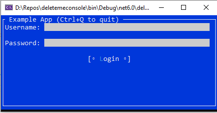

# TermUI

Cross platform terminal UI toolkit for .NET.

**TermUI**: A toolkit for building rich console apps for .NET, .NET Core, and Mono that works on Windows, the Mac, and Linux/Unix.

**Attention**: This is a particular fork - sandbox for the development of Terminal.Gui v1.


## Documentation 

* [Overview](docfx/docs/overview.md)
* [List of Views/Controls](docfx/docs/views.md)
* [Conceptual Documentation](docfx/docs/index.md)

## Features

* **Cross Platform** - Windows, Mac, and Linux. Terminal drivers for Curses, Windows Console, and the .NET Console mean apps will work well on both color and monochrome terminals. 
* **Keyboard and Mouse Input** - Both keyboard and mouse input are supported, including support for drag & drop.
* **Flexible Layout** - Supports both *Absolute layout* and an innovative *Computed Layout* system. *Computed Layout* makes it easy to lay out controls relative to each other and enables dynamic terminal UIs.
* **Clipboard support** - Cut, Copy, and Paste of text provided through the Clipboard class.
* **Arbitrary Views** - All visible UI elements are subclasses of the `View` class, and these in turn can contain an arbitrary number of sub-views.
* **Advanced App Features** - The Mainloop supports processing events, idle handlers, timers, and monitoring file descriptors. Most classes are safe for threading.

## Showcase & Examples

**TermUI** can be used with any .Net language to create feature rich and robust applications.

* **[UI Catalog](UICatalog)** - The UI Catalog project provides an easy to use and extend sample illustrating the capabilities of **TermUI**. Run `dotnet run --project UICatalog` to run the UI Catalog.
    

* **[C# Example](Example)** - Run `dotnet run` in the `Example` directory to run the C# Example.

## Sample Usage in C#

The following example shows a basic TermUI application in C#:

```csharp
// This is a simple example application.  For the full range of functionality
// see the UICatalog project

// A simple TermUI example in C# - using C# 9.0 Top-level statements

using Terminal.Gui;

Application.Run<ExampleWindow> ();

// Before the application exits, reset TermUI for clean shutdown
Application.Shutdown ();

System.Console.WriteLine ($@"Username: {ExampleWindow.Username}");

// Defines a top-level window with border and title
public class ExampleWindow : Window {
	public static string Username { get; internal set; }
	public TextField usernameText;

	public ExampleWindow ()
	{
		Title = "Example App (Ctrl+Q to quit)";

		// Create input components and labels
		var usernameLabel = new Label () {
			Text = "Username:"
		};

		usernameText = new TextField ("") {
			// Position text field adjacent to the label
			X = Pos.Right (usernameLabel) + 1,

			// Fill remaining horizontal space
			Width = Dim.Fill (),
		};

		var passwordLabel = new Label () {
			Text = "Password:",
			X = Pos.Left (usernameLabel),
			Y = Pos.Bottom (usernameLabel) + 1
		};

		var passwordText = new TextField ("") {
			Secret = true,
			// align with the text box above
			X = Pos.Left (usernameText),
			Y = Pos.Top (passwordLabel),
			Width = Dim.Fill (),
		};

		// Create login button
		var btnLogin = new Button () {
			Text = "Login",
			Y = Pos.Bottom (passwordLabel) + 1,
			// center the login button horizontally
			X = Pos.Center (),
			IsDefault = true,
		};

		// When login button is clicked display a message popup
		btnLogin.Clicked += () => {
			if (usernameText.Text == "admin" && passwordText.Text == "password") {
				MessageBox.Query ("Logging In", "Login Successful", "Ok");
				Username = usernameText.Text.ToString ();
				Application.RequestStop ();
			} else {
				MessageBox.ErrorQuery ("Logging In", "Incorrect username or password", "Ok");
			}
		};

		// Add the views to the Window
		Add (usernameLabel, usernameText, passwordLabel, passwordText, btnLogin);
	}
}
```

When run the application looks as follows:



_Sample application running_

## Installing

## Building the Library and Running the Examples

* Windows, Mac, and Linux - Build and run using the .NET SDK command line tools (`dotnet build` in the root directory). Run `UICatalog` with `dotnet run --project UICatalog`.
* Windows - Open `Terminal.sln` with Visual Studio 2022.

See [CONTRIBUTING.md](CONTRIBUTING.md) for instructions for downloading and forking the source.
