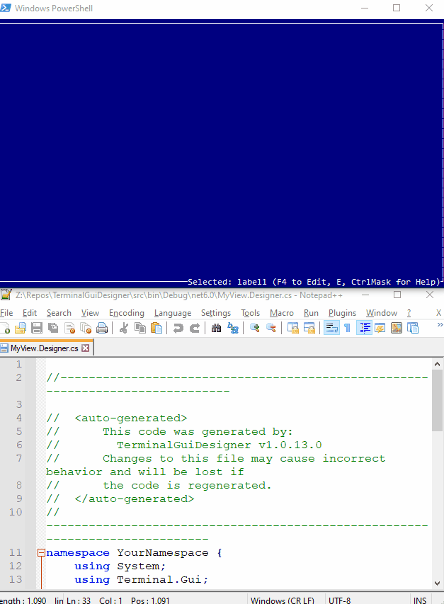

# Showcase #

* **[UI Catalog](https://github.com/gui-cs/Terminal.Gui/tree/master/UICatalog)** - The UI Catalog project provides an easy to use and extend sample illustrating the capabilities of **Terminal.Gui**. Run `dotnet run --project UICatalog` to run the UI Catalog.
    
  ⠀
* **[TerminalGuiDesigner](https://github.com/tznind/TerminalGuiDesigner)** - Cross platform view designer for building Terminal.Gui applications.
  

* **[Capital and Cargo](https://github.com/dhorions/Capital-and-Cargo)** - A retro console game where you buy, sell, produce and transport goods built with Terminal.Gui
 

  
# Examples #

* **[C# Example](https://github.com/gui-cs/Terminal.Gui/tree/master/Example)** - Run `dotnet run` in the `Example` directory to run the C# Example.
